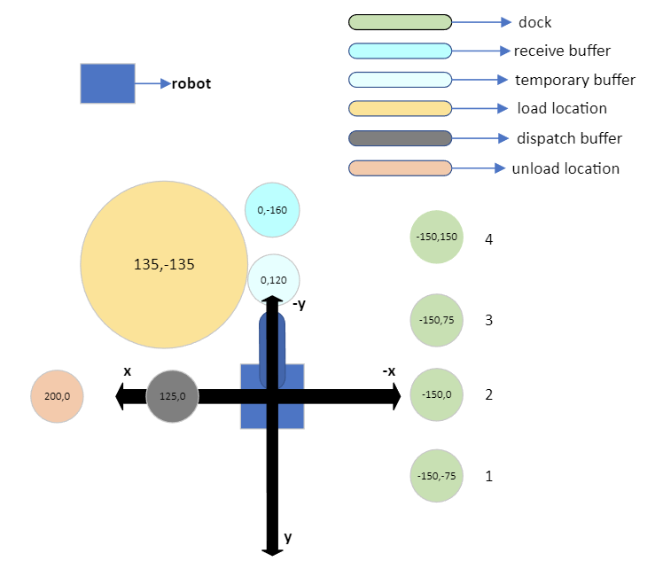

# warehouse

V Raspberry Pi
------------------------------------------------------

1. poglej IP naslov --> if config
2. zaustavljati delovanje serverja v robotu --> v terminalu : "pm2 stop 0"  !!!
3. zaženi index.js v mapi shr-mfg-robotic-arm-http-server --> node index.js  !!!

V svoj PC
----------------------------------------------------

1. spremeniti IP naslov v config.json !!!
2. start nodejs program -- node index.js
3. z vnosom v brskalnik: localhost:3000
4. start gumb za avtomatsko delovanje, stop gumb za ustavljanje avtomatskega delovanja, ostali gumbi so za testiranje
   kode oz. ročno upravljanje

## shema

## HTTP API :

| API         | parameter                                                      | return                                        |
|-------------|----------------------------------------------------------------|-----------------------------------------------
| `/dispatch` | mode(obvezna),OfferId(obvezna),location(obvezna za relocation) | accept / error                                
| `/dock`     | location,level                                                 | JSON object:podatki o shranjenem paketu       
| `/task`     | /                                                              | JSON object: vse naloge v čakalni vrsti       
| `/offer`    | /                                                              | JSON object: vsi podatki o shranjenen offerju 

### `/dock`

* če ni parametra, vrne podatke o vseh shranjenih paketih v json.file
* če je samo location nastavljen (1-4), potem prikaže podatke o shranjenem paketu na tisti lokaciji.
* če sta oba parametra nastavljena, prikaže določeno lokacijo in določeni stolpec

### `/task`

* JSON object : vse naloge v čakalni vrsti

### `/offer`

* JSON object : Offer{id, location, package ID[]}

### `/dispatch`
| mode                           | OfferId      | location |
|--------------------------------|--------------|----------
| "unload", "load", "relocation" | `__NUMBER__` | `_1-4_`  

#### load (robot shrani paket iz transporta v skladišče)

* če je parameter pravilno nastavljen, se naloga vstavi v čakalno vrsto.
* naloga se izvaja po vrstnem redu po čakalni vrsti.
* robot približa mesto, kjer odloži paket oz. mesto, kjer čaka transportni robot.
* robot izračuna kordinate centra paketa (robot zaznava samo krožno površino, nisem uporabil April tag)
* robot premakne na mesto tako, da bo center kamere po z osi kolinearen centru paket.
* robot izračuna kako daleč je paket pod kamero
* robot skenira apriltag ID
* robot naredi offset od kamere do središča orodja (pnevmatski sesalec).
* robot pobere paket in ga shrani v receive buffer
*
    * robot postopek ponavlja za vse pakete
* robot pobira pakete iz receive buffer in jih premakne na dock.
* lokacija shranjevanja se izbere na mesto, ki ima najmanj shranjenih paketov.
*
    * postopek ponavlja za vse pakete v receive buffer
* podatke ID offer, lokacija shranjevanja in vse ID pakete v tem offerju se shrani v json file v offer.json
* v dock.json so shranjeni ID paketov v posamezni lokaciji ( dock.)
* robot se vrne na izhodiščno lego.
* primer: `http://localhost:3000/dispatch?OfferId=1&mode=load`

#### unload (robot odda paket iz skladišča v transport)

* če je parameter pravilno nastavljen, program preveri kje je shranjen vnešeni offer
* če nikjer ne najde, vrne napka
* če najde, vstavi nalogo v čakalno vrsto
* če je na vrsti naloga, se robot približa na mesto, kjer je shranjen paket.
* če zadnji paket iz želenega offerja leži na najvišji stopnji, ga vzame in premakne v območje, kjer odloži paket oz. na
  transportni robot, ki čaka za sprejetje paketa
* če leži pod drugim paketom, vse pakete, ki so nad želenim paketom, začasno premaknemo.
* nato želeni paket premakne za odložitev.
* začasno premaknjeni paket premaknemo nazaj na mesto, kjer je bil prej shranjen.
* po končanju naloge se izbriše offer iz json datoteke.
* robot se vrne na izhodiščno lega.
* primer: `http://localhost:3000/dispatch?OfferId=1&mode=unload`

#### relocation

* za razliko od drugega načina delovanja je obvezno nastaviti "location" kot novo mesto shranjevanja.
* delovanje je podobna kot pri "unload"
* robot premakne vse pakete iz želenega offerja na novo lokacijo.
* primer: `http://localhost:3000/dispatch?OfferId=1&mode=relocation&location=2`

# Pametna pogodba

Pametna pogodba je razporejena v goerli testno stran z metamask preko remix. Za povezavo aplikacije in ethereuma je
uporabljena ethers.js v brskalniku.
V pametni pogodbi so funkcije:
* `getPackage(int id_offer)` ==> za pogled vseh ID-jev v Offerju.
* `addOffer(int id_offer,int lokacija_shranjevanje,array [paket ID])` ==> za dodajanje novega Offerj.
* `changeLocation(int id_offer,int lokacija)` ==> za spremembo lokacije shranjevanja Offerja.
* `removeOffer(int id)` ==> izbri Offerja.
